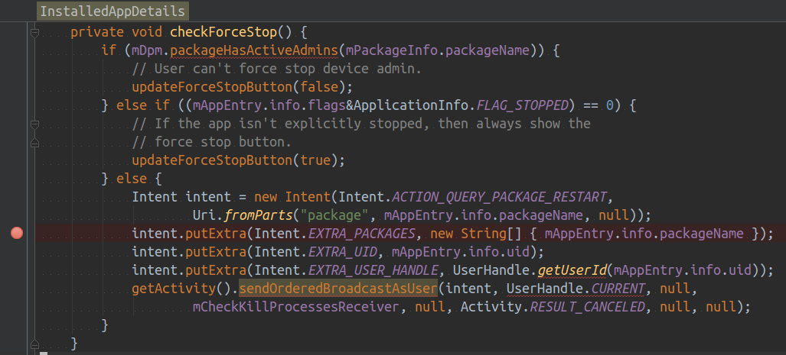
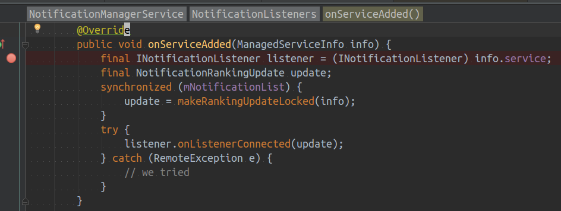
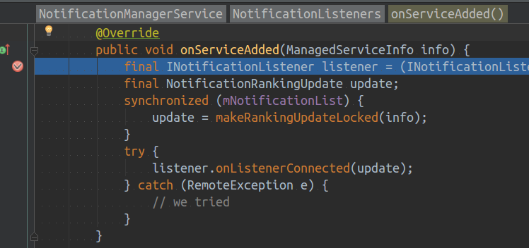
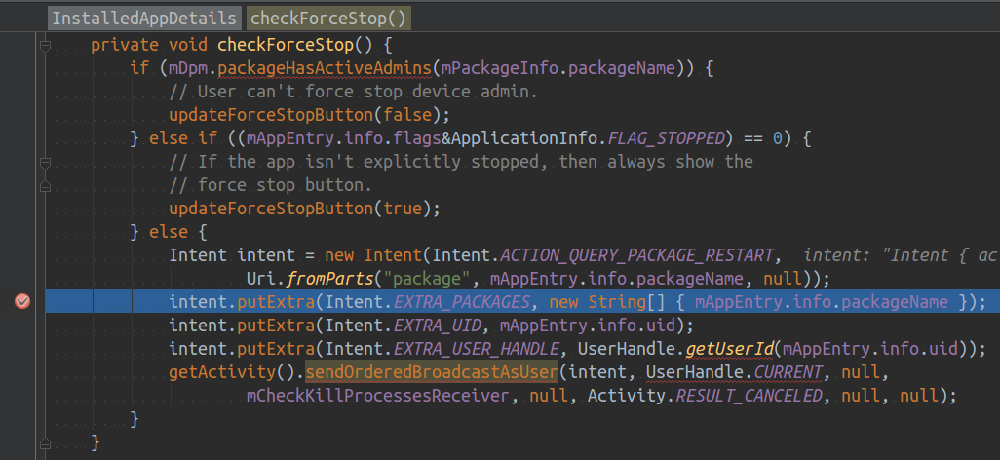
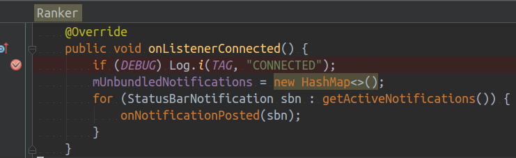
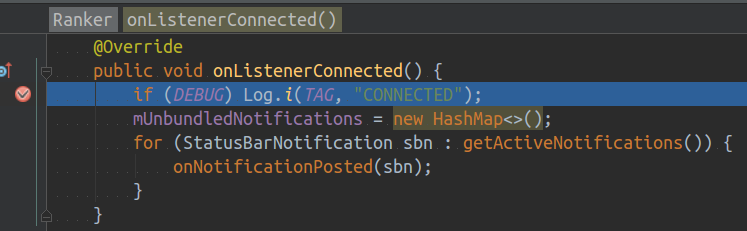

# Steps to reproduce

1. Go to Settings -> Apps -> Android Services Library
2. Add a break point in the com.android.settings.applications.InstalledAppDetails#checkForceStop as following and attach process com.android.settings to the Android Studio Debugger

3. Add a break point in the com.android.server.notification.NotificationManagerService$NotificationListeners#onServiceAdded as following and attatch process system_process to the Android Studio Debugger

4. Click Force Stop button in the Settings and confirm it. And the system_process would hang in the debug point as following.

And the Settings would hang in the debug poing as following.

5. Add a break point in the android.ext.services.notification.Ranker#onListenerConnected as following and attatch process android.ext.services to the Android Studio Debugger

6. Let the process system_process continue, and android.ext.services process hangs in the break point as following.

7. Mutate the process com.android.settings's debugger and continues the process
8. Mutate the process system_process's debugger and continue the process android.ext.services, crash happenes there.